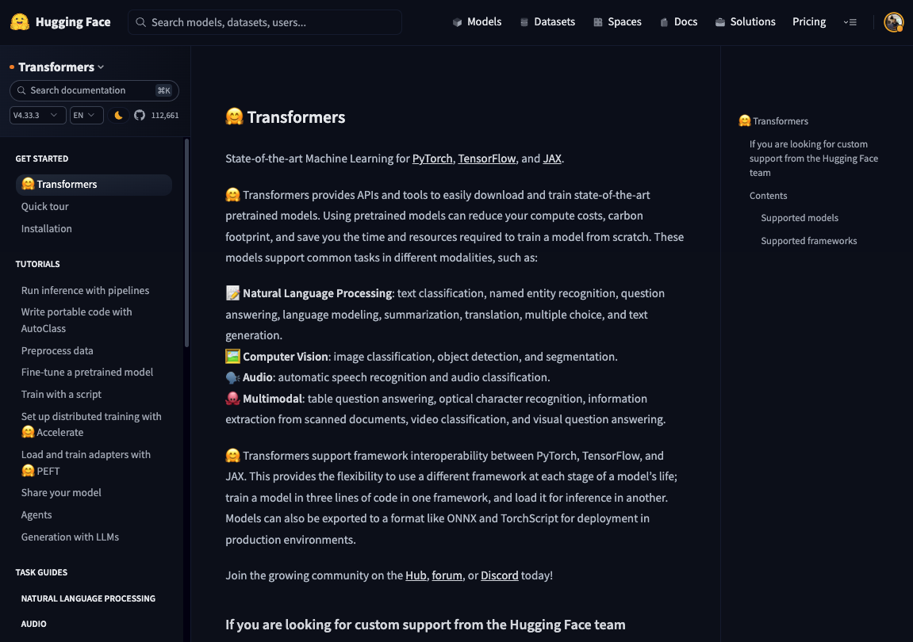
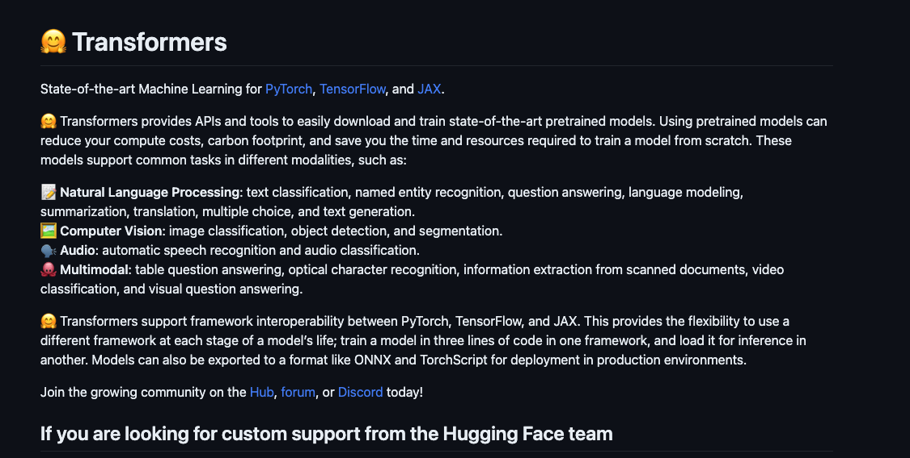

# Clipee

<div align="center">

**Web Content → Markdown, right from your terminal**

[](https://github.com/sebastian-software/clipee/actions/workflows/ci.yml)
[](https://www.npmjs.com/package/clipee)
[](https://www.npmjs.com/package/clipee)
[](https://github.com/sebastian-software/clipee/blob/main/LICENSE)
[](https://www.typescriptlang.org/)
[](https://nodejs.org/)

</div>

---

## What is Clipee?

Clipee is a CLI tool that extracts readable content from web pages and converts it to clean Markdown. Think of it as a terminal-based alternative to browser extensions like Evernote Web Clipper or Notion Web Clipper — no accounts, no extensions, just fast and scriptable content extraction.

**Key Features:**

- **Smart Extraction** — Uses Mozilla's Readability to find the main content
- **Clean Markdown** — GitHub-flavored Markdown with proper code blocks
- **Batch Processing** — Process entire directories of HTML files
- **Web Crawling** — Crawl and extract entire sites with glob patterns
- **Scriptable** — Perfect for automation and data pipelines

| HTML                                   | Markdown                                       |
| -------------------------------------- | ---------------------------------------------- |
|  |  |

## Installation

```bash
# Install globally
pnpm add -g clipee

# Or use directly with npx
npx clipee clip -u https://example.com
```

For crawling, you also need to install Playwright browsers:

```bash
npx playwright install chromium
```

## Usage

### Clip a URL

```bash
clipee clip -u https://example.com/article
```

### Clip a local HTML file

```bash
clipee clip -i article.html
```

### Batch convert a directory

```bash
clipee clip -i ./html-files -f json -o dataset.jsonl
```

### Crawl an entire site

> [!WARNING]
> Crawling can be resource intensive. Use responsibly and respect robots.txt.

```bash
clipee crawl -u https://docs.example.com -g "https://docs.example.com/**/*"
```

## CLI Reference

### `clipee clip`

Extract content from URLs or HTML files.

| Option                | Description                   | Default     |
| --------------------- | ----------------------------- | ----------- |
| `-u, --url <url>`     | URL to clip                   | —           |
| `-i, --input <path>`  | HTML file or directory        | —           |
| `-o, --output <file>` | Output file path              | `output.md` |
| `-f, --format <fmt>`  | Output format: `md` or `json` | `md`        |

### `clipee crawl`

Crawl a website and extract all pages.

| Option                   | Description                     | Default         |
| ------------------------ | ------------------------------- | --------------- |
| `-u, --url <url>`        | Starting URL                    | —               |
| `-g, --globs <patterns>` | Glob patterns (comma-separated) | —               |
| `-o, --output <file>`    | Output JSONL file               | `dataset.jsonl` |

## Programmatic API

Clipee can also be used as a library:

```typescript
import { extract_from_url, extract_from_html, crawl } from 'clipee'

// Extract from URL
const markdown = await extract_from_url('https://example.com')

// Extract from HTML string
const md = await extract_from_html('<html>...</html>')

// Crawl a site
await crawl('https://docs.example.com', 'output.jsonl', ['https://docs.example.com/**/*'])
```

## Use Cases

### Convert PDF to Markdown

Use [poppler](https://poppler.freedesktop.org/) to convert PDF to HTML first:

```bash
pdftohtml -c -s -noframes document.pdf document.html
clipee clip -i document.html -o document.md
```

### Build a documentation dataset

```bash
clipee crawl -u https://docs.example.com \
  -g "https://docs.example.com/guide/**/*,https://docs.example.com/api/**/*" \
  -o docs-dataset.jsonl
```

### Archive blog posts

```bash
for url in $(cat urls.txt); do
  clipee clip -u "$url" -o "archive/$(basename $url).md"
done
```

## Development

```bash
# Clone the repository
git clone https://github.com/sebastian-software/clipee.git
cd clipee

# Install dependencies
pnpm install

# Build
pnpm build

# Run tests
pnpm test

# Development mode (watch)
pnpm dev
```

## Built With

- [Mozilla Readability](https://github.com/mozilla/readability) — Content extraction
- [Turndown](https://github.com/mixmark-io/turndown) — HTML to Markdown conversion
- [Playwright](https://playwright.dev/) — Web crawling
- [Commander](https://github.com/tj/commander.js) — CLI framework

## License

[Apache-2.0](./LICENSE) © [Sebastian Software GmbH](https://sebastian-software.de)

---

<div align="center">

**[Report Bug](https://github.com/sebastian-software/clipee/issues)** · **[Request Feature](https://github.com/sebastian-software/clipee/issues)**

</div>
